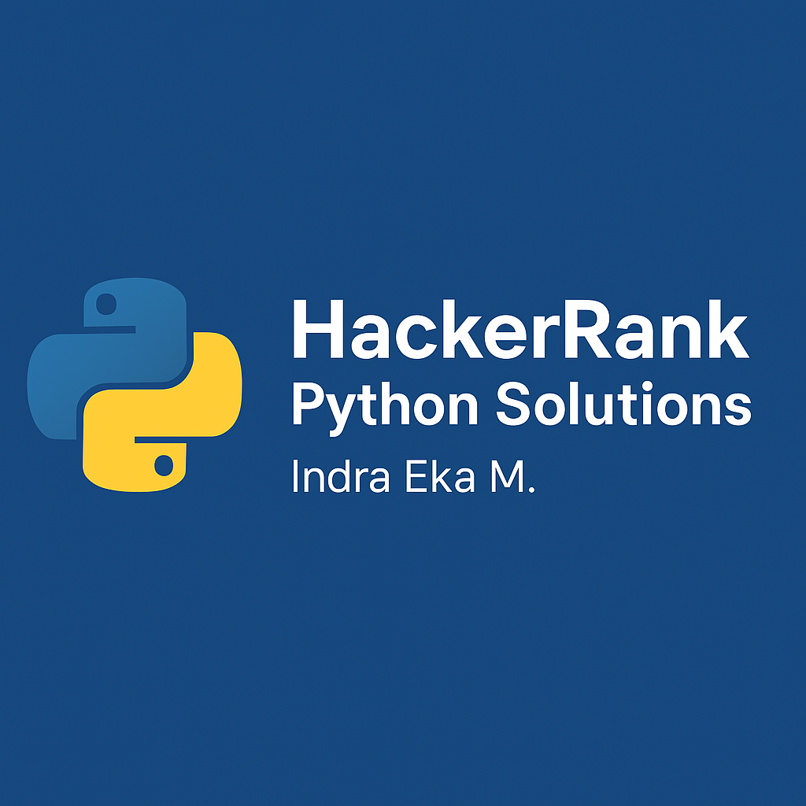

# 🐍 Python Solutions – HackerRank Practice



Kumpulan solusi Python untuk tantangan-tantangan pemrograman di platform **HackerRank**.  
Semua kode ditulis dengan pendekatan clean code dan disusun berdasarkan kategori soal.

---

## 🎯 Tujuan

Membagikan solusi latihan dari platform HackerRank untuk membantu pemula dan pengembang dalam memahami:
- Dasar-dasar Python
- Struktur data
- Manipulasi string
- Pemrograman fungsional
- Pemecahan masalah algoritmik

---

## 🧪 Contoh Format Solusi

```python
# Problem: Swap Case
def swap_case(s):
    return s.swapcase()

if __name__ == '__main__':
    s = input()
    result = swap_case(s)
    print(result)
```

---

## 👨‍💻 Author

**Indra Eka Mandriana S.Kom**  
_Machine Learning Engineer & Python Enthusiast_

---

## ⭐ Jika repositori ini bermanfaat, silakan beri ⭐ di GitHub!
